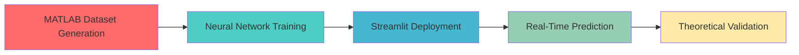

# ⚡ Chebyshev Multisection Matching Transformers (AI-Powered Design Tool)

<div align="center">


**An AI-Powered Electromagnetic Impedance Matching Solution**

[](https://www.python.org/)
[](https://streamlit.io/)
[](https://www.mathworks.com/)
[](LICENSE)

</div>

---

## 📋 Table of Contents
- [Overview](#-overview)
- [Project Workflow](#-project-workflow)
- [Key Features](#-key-features)
- [Installation](#-installation)
- [Usage](#-usage)
- [Project Structure](#-project-structure)
- [Technical Details](#-technical-details)
- [Team](#-team)
- [Acknowledgments](#-acknowledgments)

---

## 🎯 Overview

This project presents a **hybrid approach** to designing broadband impedance-matching networks using **Chebyshev multisection transformers**. The tool combines:

- **MATLAB** - For dataset generation using **Small Reflection Theory**
- **Neural Network** (MLP Regressor) - For real-time impedance prediction of complex loads
- **Streamlit GUI** - For interactive visualization and comparison

The system is designed to match complex impedance loads to a transmission line with minimal reflection across a wide bandwidth, achieving **< 1.8% prediction error** compared to classical electromagnetic theory.

### Why This Matters
Impedance matching is crucial in RF/microwave engineering for:
- 📡 Antenna systems
- 🔌 Transmission line design
- 📻 Broadband amplifiers
- 🛰️ Satellite communication systems

Traditional manual calculations using **Small Reflection Theory** are time-consuming. Our AI model provides **instant predictions** while maintaining theoretical accuracy.

---

## 🔄 Project Workflow



### Step 1: Data Generation (MATLAB)
📂 **File**: `MatLab Code/chebychev_Transformer.m`

- Generates training dataset using **Small Reflection Theory**
- Calculates characteristic impedances (Z₁, Z₂, Z₃, Z₄, Z₅) for N=5 sections
- Outputs: `Chebyshev_Dataset.xlsx`

**Key Parameters**:
- Ripple factor: $a_m = 0.05$
- Number of sections: N = 5
- Symmetric Chebyshev polynomial response

### Step 2: AI Training
📂 **File**: `Al Model/train_model.py`

- Loads the MATLAB-generated dataset
- Trains an **MLPRegressor** (Multi-Layer Perceptron)
  - Architecture: 100-100 hidden layers
  - Activation: ReLU
  - Solver: Adam optimizer
- Uses `StandardScaler` for input/output normalization
- Splits data: 80% training, 20% testing

**Model Performance**:
- Mean Absolute Error: < 5 Ω (on test set)
- Percentage Error: < 1.8%

### Step 3: Deployment (Streamlit GUI)
📂 **File**: `Al Model/app.py`

- Interactive web interface for real-time predictions
- Compares AI output with manual theoretical calculations
- Visualizes **frequency response** using Chebyshev polynomial of degree 5
- Displays impedance sections (Z₁-Z₅) and percentage errors

---

## ✨ Key Features

| Feature | Description |
|---------|-------------|
| 🚀 **Real-Time Inference** | Instant impedance prediction for user-defined complex loads |
| ✅ **Automated Validation** | Built-in comparison with Small Reflection Theory (< 1.8% error) |
| 📊 **Dynamic Visualization** | Plots normalized frequency response with ripple factor $a_m = 0.05$ |
| 🎨 **User-Friendly GUI** | Clean Streamlit interface with parameter inputs and results dashboard |
| 🔬 **Research-Grade Accuracy** | Validated against classical electromagnetic theory |
| 📈 **Bandwidth Analysis** | Displays Chebyshev transformer frequency characteristics |

---

## 🛠️ Installation

### Prerequisites
- **Python** 3.8 or higher
- **MATLAB** R2020a or higher (for dataset regeneration)
- **pip** package manager

### Step 1: Clone the Repository
```bash
git clone https://github.com/karim238253/Chebyshev-AI-Matcher.git
cd Chebyshev-AI-Matcher
```

### Step 2: Install Dependencies
```bash
pip install -r requirements.txt
```

The required packages include:
- `streamlit` - Web application framework
- `pandas` - Data manipulation
- `numpy` - Numerical computations
- `scikit-learn` - Machine learning (MLPRegressor)
- `matplotlib` - Plotting
- `openpyxl` - Excel file handling
- `Pillow` - Image processing

### Step 3: Verify Installation
```bash
streamlit --version
python --version
```

---

## 🚀 Usage

### Running the AI-Powered GUI

Navigate to the AI Model folder and launch the Streamlit app:

```bash
cd "Al Model"
streamlit run app.py
```

The application will open in your default browser at `http://localhost:8501`

### Input Parameters
1. **Characteristic Impedance (Z₀)**: Transmission line impedance (default: 85 Ω)
2. **Load Real Part (R_L)**: Resistive component of load (default: 300 Ω)
3. **Load Imaginary Part (X_L)**: Reactive component of load (default: 200 Ω)

### Output Sections
- **🤖 AI Model Output**: Neural network predictions for Z₁-Z₅
- **📐 Theoretical Output**: Manual calculations using Small Reflection Theory
- **📊 Accuracy Table**: Percentage error comparison
- **📈 Frequency Response**: Chebyshev polynomial response plot

---

## 📂 Project Structure

```
Chebyshev-AI-Matcher/
│
├── Al Model/                               # AI and Streamlit application
│   ├── app.py                              # Main Streamlit GUI
│   ├── train_model.py                      # Neural network training script
│   ├── Chebyshev_Dataset.xlsx              # Training dataset
│   ├── Black Text BUE Logo.png             # University logo
│   ├── logo.png                            # Project logo
│   └── Note run this Pyp lib before start the code.txt
│
├── MatLab Code/                            # Dataset generation
│   ├── chebychev_Transformer.m             # MATLAB impedance calculator
│   └── Chebyshev_Dataset.xlsx              # Generated dataset
│
├── Report/                                 # Project documentation
│   ├── EMW Project Report.pdf              # Final report (PDF)
│   └── EMW Project Report.docx             # Final report (Word)
│
├── README.md                               # This file
├── requirements.txt                        # Python dependencies
└── .gitignore                              # Git ignore rules
```

---

## 🔬 Technical Details

### Small Reflection Theory
The project implements the **binomial transformation approach**:

1. **Reflection Coefficient**: 
   $$\Gamma_L = \frac{Z_L - Z_0}{Z_L + Z_0}$$

2. **Chebyshev Constant (S)**:
   $$S = \cosh\left(\frac{1}{N} \cdot \text{arccosh}\left(\frac{|\Gamma_L|}{a_m}\right)\right)$$

3. **Section Impedances** (using symmetry for N=5):
   $$Z_{i+1} = Z_i \cdot \exp(2\Gamma_i)$$

### Neural Network Architecture
- **Input Layer**: 3 neurons (Z₀, R_L, X_L)
- **Hidden Layers**: 100 → 100 neurons (ReLU activation)
- **Output Layer**: 5 neurons (Z₁, Z₂, Z₃, Z₄, Z₅)
- **Optimizer**: Adam
- **Training Epochs**: 5000 iterations

### Frequency Response
The normalized reflection coefficient is calculated using:
$$|\Gamma(f)| = a_m \cdot |T_N(S \cdot \cos\theta)|$$

where $T_N$ is the Chebyshev polynomial of degree N=5.

---

## 👥 Team

### Supervision
- **Prof. Hani Ghali** - Project Supervisor
- **Eng. Malak Ibrahim** - Teaching Assistant

### Development Team (Group 5)
| Name | Student ID | Role |
|------|------------|------|
| **Kareem Mohammed** | 238253 | Lead Developer & AI Implementation |
| **Rawan Essam** | 235067 | MATLAB Dataset Generation |
| **Kenzy Ashraf** | 219253 | Theoretical Validation |
| **Jana Ahmed** | 219537 | Documentation & Testing |

**Institution**: The British University in Egypt (BUE)  
**Department**: Electrical Engineering and Communications  
**Course**: Electromagnetic Waves  
**Academic Year**: 2025-2026

---

## 🙏 Acknowledgments

This project was developed as part of the **Electromagnetic Waves** course at BUE. Special thanks to:
- Prof. Hani Ghali for guidance on electromagnetic theory
- Eng. Malak Ibrahim for technical support
- The Faculty of Engineering at BUE for providing resources

---

## 📄 License

This project is licensed under the MIT License - see the [LICENSE](LICENSE) file for details.

---

## 📧 Contact

For questions or collaboration:
- **GitHub**: [@karim238253](https://github.com/karim238253)
- **Repository**: [Chebyshev-AI-Matcher](https://github.com/karim238253/Chebyshev-AI-Matcher)

---

<div align="center">

**⚡ Powered by Neural Networks & Classical EM Theory ⚡**

Made with ❤️ by Group 5 | BUE Engineering

</div>
